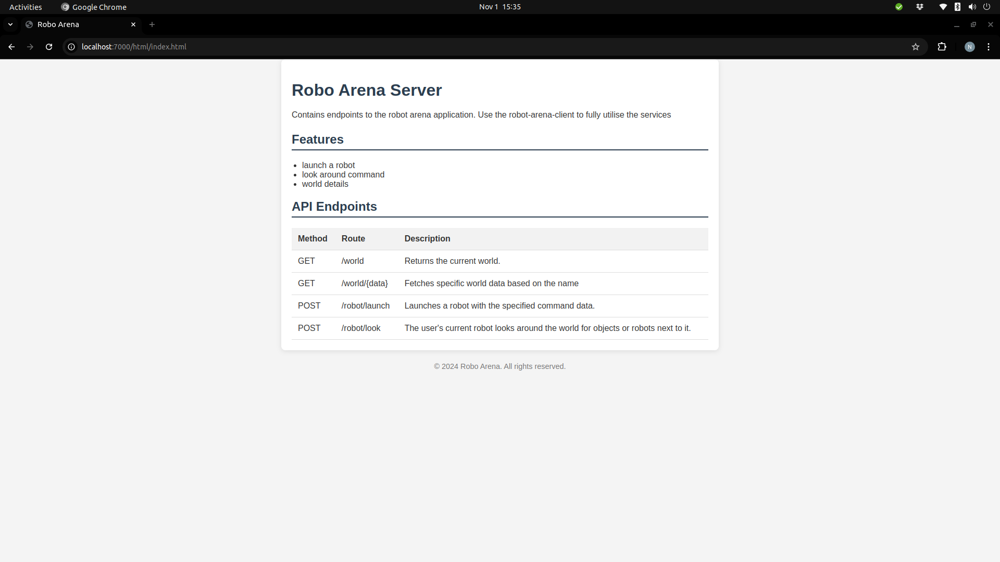

# Robo-Arena-Server

## Project description:
This project is a server for the Robo-Arena application. It is responsible for managing the game state, handling player input, and communicating with the client.

## View the server live [here](https://robo-arena-server.azurewebsites.net/):

## Output

## System requirements:
- Java
- Maven
- Make
- Docker
- SQLite

 

## Running instructions:
##### Building the project
1. Run this command to build the project:
        
        make all

##### Running the server
1. Run the server:
        
        make run-server

##### Running the client:
1. Run the client:
        
        make run-client

##### Running the webapi:
1. Run the webapi:
        
        make run-webapi
            

## Docker running instructions:
##### Checking availaable images:
    docker images

##### Building the docker image:
    docker build -t robo-arena-server-image .

##### Running the docker image:
    docker run -p 7000:7000 robo-arena-server-image

##### Running the docker image:
    docker run -p 7000:7000 -rm -t nkosimlaba/robo-arena-server:latest

##### Pulling the docker image:
    docker pull nkosimlaba/robo-arena-server:latest

##### Pushing the docker image:
    docker push nkosimlaba/robo-arena-server:latest

